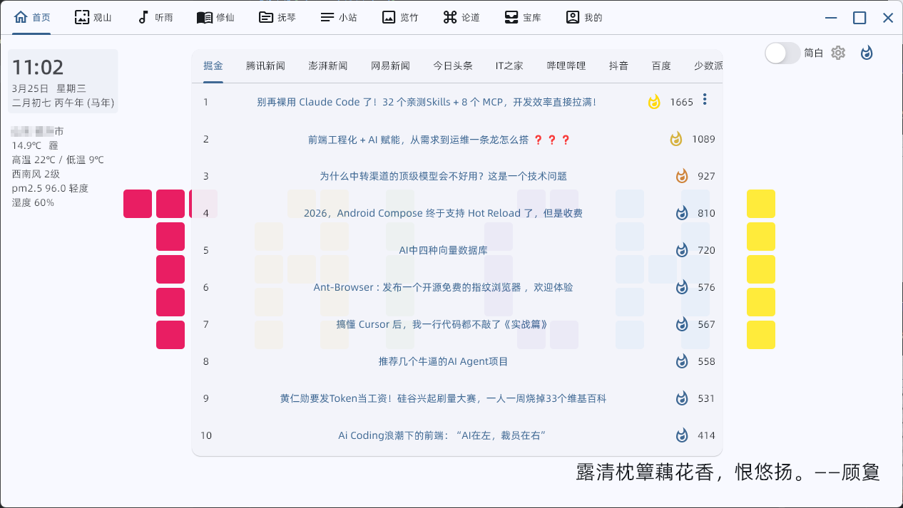
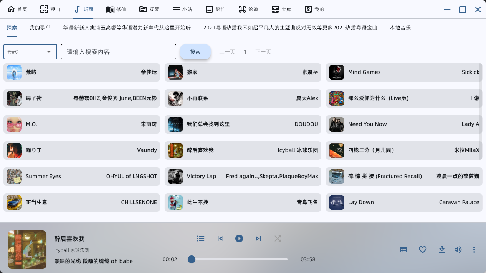
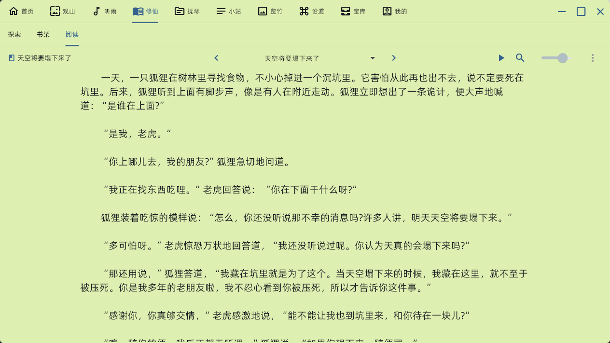
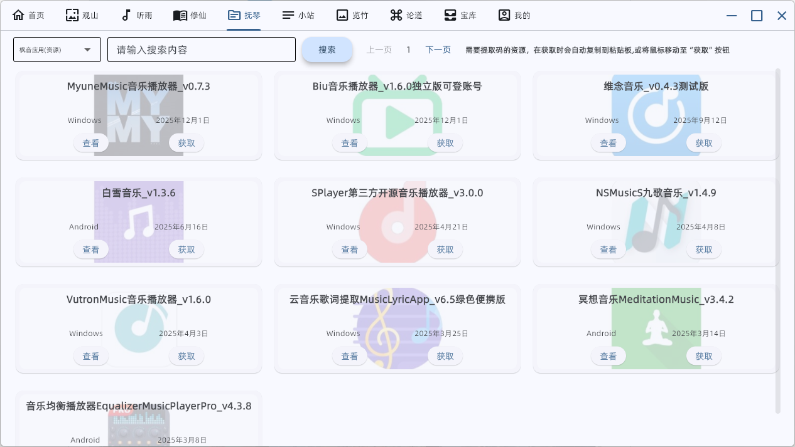
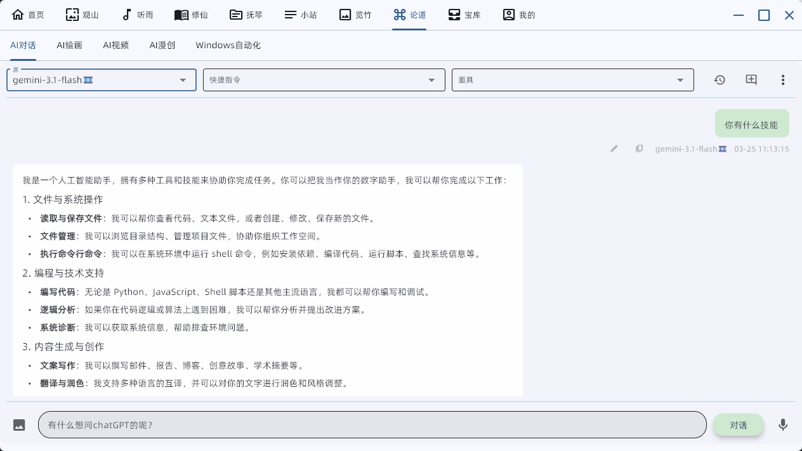
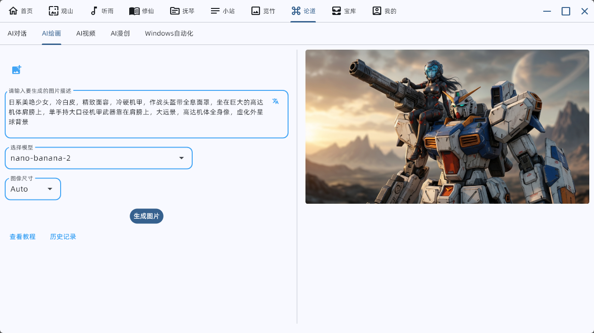
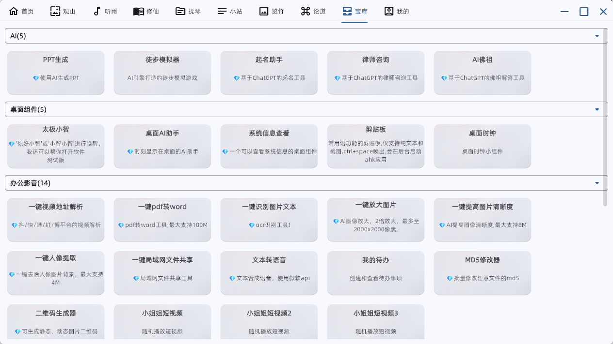

  

<h1 align="center">TAICHI-flet</h1>

  
  
  

---

 基于flet的一款windows桌面应用，实现了浏览图片、音乐、小说、各种资源的功能，还有gpt、ai绘画等高级功能。

 特点：多功能娱乐软件，界面美观、简洁。
 
 （开源代码已不更新，软件包持续更新中）
 
会持续更新

## 最新版本(2025年12月30日)

为保证太极正常使用，请【安装3.2.8版本】

电脑版《太极》3.2.8版本下载地址

[https://moshangwangluo.com](https://moshangwangluo.com)

---

## 功能介绍

1. 首页

右上角可切换主题、进行全局个性化设置、显示热搜榜，点击左上角时间可使用默认壁纸。

2. 观山——图片浏览，风景图、妹子图、二次元图等
   

右下角可选择下载、设为壁纸、调整壁纸模糊度等。

3. 听雨——音乐收藏、试听

点击底部头像进入沉浸页，点击歌词打开桌面歌词。

4. 修仙——小说搜索、阅读

可选择加入书架，可选择听小说模式。

5. 抚琴——云盘资源、软件资源搜索

6. 小站——资源、影视查找

7. 览竹——动漫搜索、观看

8. 论道——ChatGPT、AI绘画(高级功能)

9. 宝库——几十种工具

## 关注公众号了解更多功能

## Star历史

